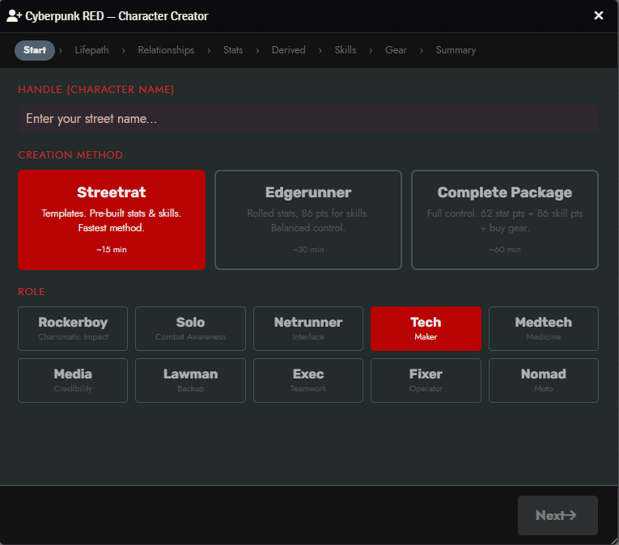
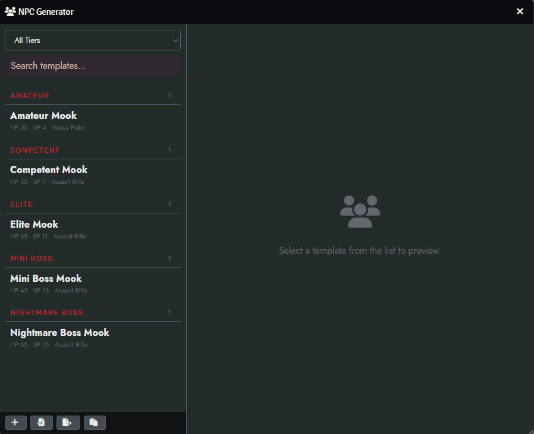
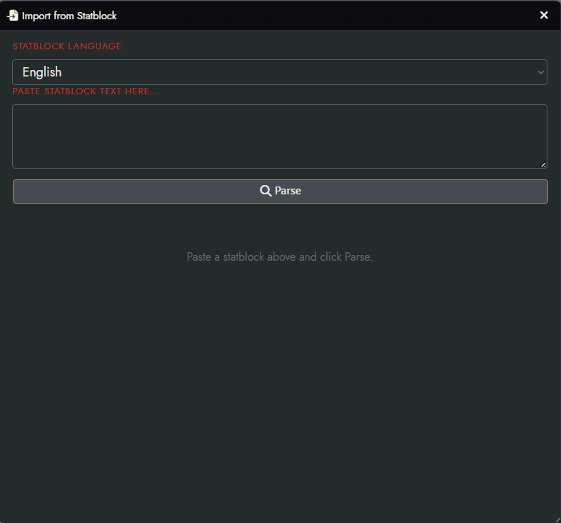
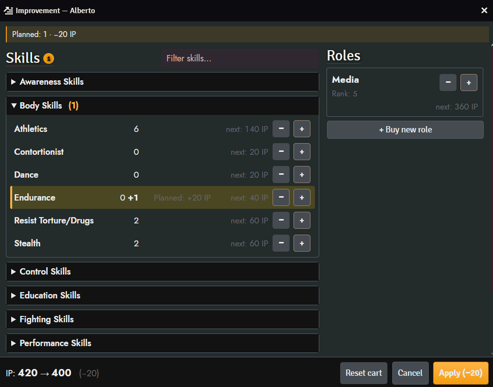
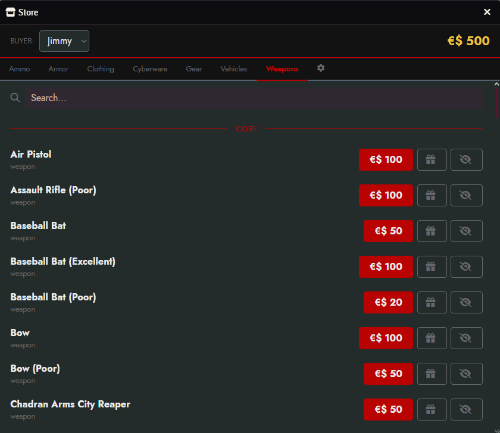
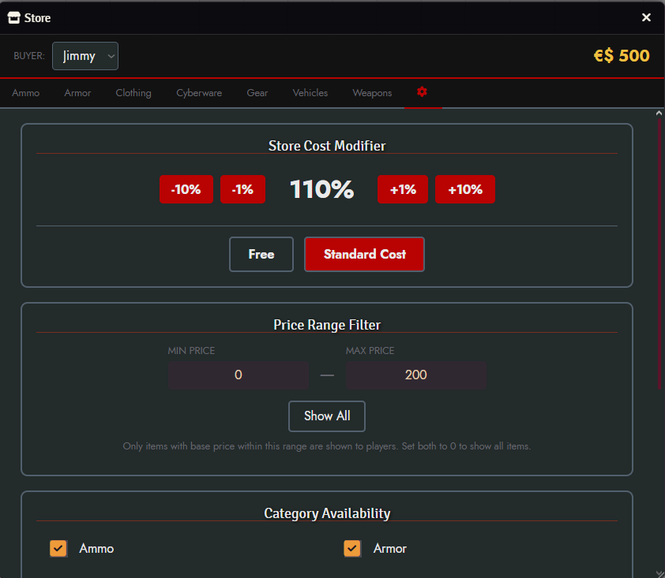

# Cyberpunk RED Wizards

A Foundry VTT module for **Cyberpunk RED** that adds a step-by-step **Character Creator**, an **NPC Generator** with a statblock importer and custom-template editor, and an in-game **Store** for buying equipment.

Requires the [Cyberpunk RED - CORE](https://gitlab.com/cyberpunk-red-team/fvtt-cyberpunk-red-core) system and the [socketlib](https://github.com/manuelVo/foundryvtt-socketlib) module.

---

## Character Creator

A guided wizard that walks players through the full character creation process from handle to gear.



**Three creation methods:**

| Method | Description | Time |
|--------|-------------|------|
| **Streetrat** | Pre-built stat & skill templates. Fastest way to get playing. | ~15 min |
| **Edgerunner** | Rolled stats with 86 skill points to distribute. Balanced control. | ~30 min |
| **Complete Package** | Full control — 62 stat points, 86 skill points, and manual gear purchases. | ~60 min |

**Steps:** Start → Lifepath → Relationships → Stats → Derived → Skills → Gear → Summary

- All 10 roles supported (Rockerboy, Solo, Netrunner, Tech, Medtech, Media, Lawman, Exec, Fixer, Nomad)
- Lifepath tables with roll-or-choose for each entry
- Automatic derived stat calculation (HP, Serious Wound, Death Save, Humanity, Walk/Run)
- Skill point allocation with x2-cost skill tracking
- Role-specific gear presets with alternatives, or manual budget-based purchasing
- Validation checklist on the summary page before final creation
- Creates a fully populated actor with all stats, skills, equipment, and cyberware

Access via the **Character Creator** button in the Actors sidebar.

---

## NPC Generator

Instantly create combat-ready NPCs from pre-built templates organized by category — or build and import your own.



**Categories** are GM-editable: add, rename, reorder, or remove groups via **Module Settings → NPC Categories**. Templates whose category is removed appear under **Uncategorized**. The default categories are Amateur, Competent, Elite, Mini Boss, and Nightmare Boss — but any structure works.

Each template includes pre-configured stats, armor, weapons, skills, cyberware, and equipment. Search and filter by category, preview the full stat block, override the name, pick gear alternatives, and choose between **Mook** or **Character** actor type before creating.

**Custom templates:**
- Start from a **New Blank Template** or **Save as Custom** from any built-in, then refine it in a multi-step editor (basics, combat, skills, extras)
- **Edit** and **Delete** your custom templates
- **Export** and **Import** custom templates as JSON to share them between worlds

**Import from Statblock:**



Paste a Cyberpunk RED NPC statblock directly from the sourcebook (English or Polish) and the parser turns it into a full template automatically.

**How it works:**

1. **Paste** — Drop the raw statblock text into the import dialog
2. **Parse** — The parser detects sections (Stats, HP, Armor, Weapons, Skills, Equipment) and maps each term to its exact compendium entry
3. **Preview** — Review the result: stats, armor, weapons, skills, cyberware, equipment, and role ability; warnings flag anything unrecognized or ambiguous
4. **Create or Save** — Hit **Create NPC** to spawn the actor immediately, or **Save as Template** to add it to your custom template list for repeated use

**What gets parsed:**

| Section | Details |
|---------|---------|
| Stats | INT, REF, DEX, TECH, COOL, WILL, LUCK, MOVE, BODY, EMP plus HP, Serious Wound threshold, Death Save |
| Armor | Head and body SP values mapped to compendium armor items |
| Weapons | Matched by name to compendium weapons; quality prefix detected (Poor / Standard / Excellent) |
| Skills | Matched against actor skills; level calculated from the linked stat |
| Cyberware | Cyberweapons (Rippers, Wolvers, etc.) routed to cyberware rather than weapons |
| Equipment & Ammo | Matched to gear and ammo compendium packs |
| Role Ability | Leading bold ability (e.g. *Interface 4*) resolved to role item and rank |

After parsing, the GM selects a category for the imported template in the preview dialog (defaults to Uncategorized). No category is inferred automatically from HP.

Access via the **NPC Template** button in the Actors sidebar.

---

## Improvement

Spend a character's **Improvement Points (IP)** to raise skills and roles, with a planning cart that lets you stage changes and see the full cost before committing.



- **Skills** grouped by category (Awareness, Body, Control, …) with a filter box; **+/−** to stage level changes
- **Roles** raised by rank alongside skills
- IP costs follow Cyberpunk RED Core (p. 134): skills cost `20 × next level` (`40 ×` for Difficult skills), roles cost `60 × next rank`
- A running **Planned** banner and `IP: before → after` footer show the net spend before you apply
- **Reset cart** to clear staged changes, **Cancel** to close, or **Apply** to commit them to the actor
- Presence awareness warns when another user has the same character's Improvement window open

Access via the **Improvement** button at the bottom of the Actors sidebar (available to the GM and to players with an assigned character).

---

## Store

A shared shopping interface where players browse and buy equipment from the system's compendium packs. Purchases are deducted from the character's Eurodollars automatically.



**Player features:**
- Browse items by category: Ammo, Armor, Clothing, Cyberware, Gear, Programs, Upgrades, Vehicles, Weapons
- Search across all items
- Items grouped by source (Core, Black Chrome, DLC, World)
- Buy with confirmation dialog showing balance before and after

**GM controls** (settings tab inside the Store):



- **Cost modifier** — adjust all prices globally (percentage-based, or set to free)
- **Price range filter** — restrict which items are visible by price
- **Category availability** — enable/disable entire item categories
- **Hide individual items** — remove specific items from the store
- **Exclude compendium packs** — hide entire packs (configured in module settings)
- **Loot mode** — GMs can add items to characters for free

Access via the **Store** button in the Items sidebar.

---

## Installation

1. In Foundry VTT, go to **Settings → Manage Modules → Install Module**
2. Paste the manifest URL and click **Install**:
   ```
   https://github.com/sudo-sein/cyberpunk-red-wizards/releases/latest/download/module.json
   ```
3. Enable **Cyberpunk RED Wizards** in your world's module settings

### Requirements

| Dependency | Minimum Version |
|------------|----------------|
| Foundry VTT | v12 |
| Cyberpunk RED - CORE | 0.92 |
| socketlib | 1.0.10 |

## Known Bugs

- Newly created character sheet (Actor) tend to have inconsistent HP value from Character Creator calculation. Click on "Hit Points" label to update to accurate value.
- If you update the module and you don't see changes/ updated version, you need to clear your browser cache in order to refresh scripts and styles of the module. In some cases you might need to disable and reenable whole module.

## Languages

- English
- Polish (Polski)

## License

See [LICENSE](LICENSE) for details.
